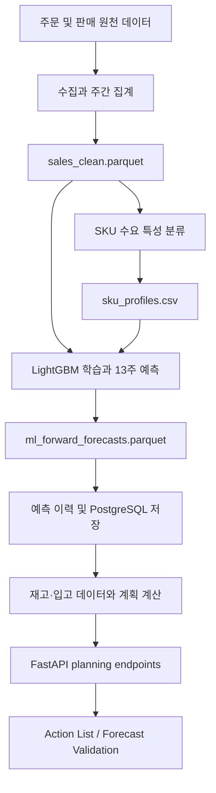

# Time Series Forecasting

차량용 시트 커버와 액세서리의 **SKU별 주간 수요를 예측하고, 그 결과를 재고·입고 정보와 결합해 발주 판단에 사용할 수 있도록 제공하는 프로젝트**입니다.

이 저장소에는 다음 구성 요소가 함께 들어 있습니다.

- 판매 이력을 정리하고 SKU의 수요 특성을 분류하는 데이터 파이프라인
- 향후 13주의 주간 수요를 생성하는 LightGBM 예측 모델
- 예측 결과를 재고 계획 정보로 바꾸는 계산 계층
- Action List와 Forecast Validation 화면에 데이터를 제공하는 FastAPI 서비스
- 모델 실험, 백테스트, 운영 점검, 주간 실행을 위한 스크립트

화면 자체는 별도의 `Commerce_Integration` 저장소에 있습니다. 이 저장소는 모델과 데이터 파이프라인, 계산 로직, API를 담당합니다.

## 한눈에 보기

| 항목 | 내용 |
|---|---|
| 예측 단위 | SKU별 주간 판매 수량 |
| 예측 기간 | 앞으로 13주 |
| 운영 모델 | LightGBM v11 하이브리드 모델 |
| 예측 대상 | 규칙적인 수요가 있는 `smooth` SKU |
| 별도 관리 대상 | 판매가 드문 `intermittent` SKU |
| API | FastAPI, 기본 포트 `8000` |
| 운영 주기 | 매주 데이터 갱신 및 예측 생성 |
| 주요 저장 형식 | Parquet, CSV, PostgreSQL |
| 기준 주차 | 월요일 라벨의 주간 데이터(`W-MON`) |

## 프로젝트가 해결하는 문제

구매 담당자는 SKU마다 앞으로 얼마나 팔릴지 알아야 재고 부족과 과잉 발주를 줄일 수 있습니다. 하지만 단순 이동 평균이나 최근 판매 속도만 사용하면 다음 문제가 생깁니다.

1. 수요가 빠르게 증가하거나 감소하는 구간을 늦게 따라갑니다.
2. 크리스마스와 같은 계절 효과를 최근 평균만으로 설명하기 어렵습니다.
3. 출시된 지 얼마 되지 않은 상품과 판매 이력이 긴 상품의 특성이 다릅니다.
4. 판매가 거의 없는 SKU에 일반적인 시계열 모델을 적용하면 의미 없는 예측이 만들어집니다.

이 프로젝트는 SKU를 수요 특성에 따라 분류하고, 예측 가능한 SKU에는 이력 길이에 맞는 모델을 적용합니다. 생성된 수요 예측은 현재고, 할당 재고, 입고 예정 수량과 결합되어 권장 발주량과 우선순위 계산에 사용됩니다.

## 전체 동작 흐름



운영 파이프라인의 핵심 단계는 다음과 같습니다.

1. 원천 주문 데이터를 가져옵니다.
2. 주문 데이터를 월요일 기준 주간 판매량으로 정리합니다.
3. 각 SKU를 `smooth` 또는 `intermittent`로 분류하고 이력 길이를 계산합니다.
4. 운영 모델을 학습해 SKU별 13주 예측을 생성합니다.
5. 예측과 비교용 V1 결과를 파일과 데이터베이스에 저장합니다.
6. API가 예측, 재고, 입고 정보를 결합해 화면에 필요한 값을 반환합니다.

파이프라인의 자세한 입력·출력과 실패 처리 방식은 [데이터 및 파이프라인 문서](docs/DATA_AND_PIPELINE_KO.md)를 참고하세요.

## 예측 모델을 쉽게 설명하면

운영 모델은 모든 SKU의 절대 판매량을 그대로 외우는 대신, **각 SKU의 최근 기준 수요에 비해 앞으로 수요가 몇 배가 될지** 학습합니다. 이렇게 하면 판매 규모가 다른 여러 SKU를 하나의 모델에서 함께 학습할 수 있습니다.

모델은 다음 정보들을 이용합니다.

- 몇 주 앞을 예측하는지 나타내는 예측 지평
- 최근 판매 수준과 직전 주 변화
- 장기 수요 수준과 추세
- SKU의 판매 이력 길이
- 월별 계절성과 연말 성수기 효과

`smooth` SKU는 다시 이력 길이에 따라 나뉩니다.

- `short`: 활성 판매 이력이 50주 미만인 SKU
- `long`: 활성 판매 이력이 50주 이상인 SKU

short SKU는 전체 smooth SKU에서 학습한 공유 모델을 사용하고, long SKU는 이력이 긴 상품만으로 학습한 전용 모델을 사용합니다. 계절 효과는 학습 전에 제거하고 예측 후 다시 적용하여 모델이 기본 수요 변화와 계절 변화를 혼동하지 않도록 합니다.

판매가 드문 `intermittent` SKU에는 연속적인 주간 예측을 제공하지 않습니다. 대부분의 주가 0인 상품은 일반적인 평균 수요 예측보다 별도의 재주문 정책으로 관리하는 편이 적합하기 때문입니다.

모델 구조, 피처, 세그먼트 규칙과 실험 방법은 [모델 문서](docs/MODEL_KO.md), 머신러닝 배경지식 없이 읽는 설명은 [모델 입문서](docs/MODEL_PRIMER_KO.md)를 참고하세요.

## 저장소 구조

```text
Time_Series_Forecasting/
├── api/                    # FastAPI 애플리케이션과 HTTP 엔드포인트
│   ├── main.py             # 현재 운영 API의 진입점
│   ├── common.py           # API 공통 유틸리티
│   └── legacy/             # 퇴역한 statsforecast API 코드
├── src/                    # 재사용 가능한 핵심 비즈니스 로직
│   ├── ml/                 # 데이터셋, LightGBM 모델, 평가, serving 계층
│   ├── planning/           # 재고 계획, 발주량, 신뢰도, 데이터 품질 계산
│   ├── legacy/             # 퇴역한 통계 모델 구현
│   ├── clean.py            # 판매 데이터 정제와 주간 집계
│   ├── ingest.py           # 데이터베이스 원천 데이터 수집
│   ├── profile.py          # SKU 수요 패턴과 이력 길이 분류
│   ├── v1.py               # 기존 규칙 기반 예측의 기준 구현
│   └── weeks.py            # 프로젝트 전체의 주차 계산 규칙
├── scripts/                # 실행 가능한 운영·실험·검증 스크립트
│   ├── ml_prepare_data.py  # 수집부터 예측까지 실행하는 개발용 진입점
│   ├── ml_forward_forecast.py # 운영 모델 학습과 13주 예측 생성
│   ├── run_forecast_cron.sh   # 서버의 주간 자동 실행 진입점
│   ├── setup_local.py      # 로컬 환경 자동 구성
│   ├── verify_repo.py      # 저장소 정적 검증
│   ├── smoke_planning_api.py # planning API 스모크 테스트
│   ├── ml_*.py             # 모델 실험, 평가, 리포트 스크립트
│   └── legacy/             # 퇴역 파이프라인 실행 스크립트
├── data/
│   ├── dev_seed/           # DB 없이 로컬 실행에 사용하는 고정 예측 데이터
│   ├── snapshots/          # 재현 가능한 모델 평가용 고정 데이터셋
│   ├── inventory/          # 재고 스냅샷과 예제
│   └── processed/          # 현재 실행 데이터, Git 추적 제외
├── outputs/
│   ├── reports/            # 정확도와 검증 결과 중 추적되는 리포트
│   ├── models/             # 학습된 모델 산출물, Git 추적 제외
│   └── forecasts/          # 생성된 예측 산출물, Git 추적 제외
├── docs/                   # 설계, 운영, 화면, 배포 문서
│   └── archive/            # 완료된 작업 기록과 과거 설계 자료
├── deploy/                 # systemd 서비스 정의
├── notebooks/              # 탐색 및 과거 실험 노트북
├── .github/workflows/      # 검증, 배포, 서버 진단 자동화
├── config.py               # 모델·데이터·평가의 공통 설정
├── requirements.txt        # 재현성을 위해 버전을 고정한 Python 의존성
├── .env.example            # 환경 변수 설명과 템플릿
└── setup.cmd               # Windows용 초기 설정 진입점
```

### 핵심 디렉터리의 책임

`src/ml/`은 모델 개발과 serving의 중심입니다. 데이터 분할, 피처 생성, LightGBM 학습, 평가, 운영 모델 등록이 이곳에 있습니다. 현재 기본 모델은 `src/ml/serving/models.py`의 `CURRENT_BEST`가 결정합니다.

`src/planning/`은 예측을 업무 판단으로 바꿉니다. 예측만으로 발주량을 정하지 않고 현재고, 할당량, 입고 예정 수량, 수요 밴드, 데이터 신뢰도를 함께 계산합니다.

`api/main.py`는 계산 결과를 HTTP로 제공합니다. 요청 시 모델을 새로 학습하지 않고, 미리 생성된 예측 파일이나 데이터베이스 값을 읽기 때문에 일반 조회 응답은 빠릅니다.

`scripts/`는 사람이 직접 실행하거나 cron과 CI가 호출하는 진입점입니다. 번호가 붙은 `ml_*.py` 파일 중 상당수는 특정 가설을 검증한 실험 기록입니다. 현재 운영 흐름을 찾을 때는 `ml_prepare_data.py`, `ml_forward_forecast.py`, `run_forecast_cron.sh`부터 보는 것이 좋습니다.

`src/legacy/`, `api/legacy/`, `scripts/legacy/`에는 2026년 8월에 운영에서 제외된 statsforecast 기반 프로토타입이 보존되어 있습니다. 비교와 이력 확인용이며 현재 API에는 라우터가 연결되어 있지 않습니다.

## 데이터 구분과 재현성

이 프로젝트에서는 목적이 다른 두 종류의 데이터를 명확히 구분합니다.

| 구분 | 경로 | 용도 | Git 추적 |
|---|---|---|---|
| 운영 데이터 | `data/processed/` | 최신 예측 생성과 API 제공 | 아니요 |
| 평가 스냅샷 | `data/snapshots/<이름>/` | 모델 간 동일 조건 비교 | 예 |
| 개발 시드 | `data/dev_seed/` | DB 없이 로컬 API 실행 | 예 |
| 재고 스냅샷 | `data/inventory/` | 로컬 계획 계산의 보조 입력 | 일부 |

`config.py`의 두 설정은 모델 평가 재현성에 중요합니다.

- `ML_FINAL_TEST_CUTOFF`: 평가 구간에 포함되는 주차를 고정합니다.
- `ML_DATA_SNAPSHOT`: 평가에 사용하는 실제 데이터 값을 고정합니다.

주간 운영 데이터는 늦게 등록된 주문 때문에 과거 값도 조금씩 바뀔 수 있습니다. 따라서 평가 구간만 고정하고 최신 데이터를 읽으면 같은 모델의 점수가 실행 날짜에 따라 달라질 수 있습니다. 이 프로젝트는 주차와 데이터 스냅샷을 함께 고정해 기록된 실험을 재현합니다.

주의할 점은 다음과 같습니다.

- 로컬 개발 시드는 화면 개발용 고정 데이터이며 최신 발주 판단에 사용하면 안 됩니다.
- 운영 예측에는 `--snapshot live`를 사용해야 합니다. 기본값은 재현 가능한 평가용 스냅샷입니다.
- `data/processed/`, `outputs/models/`와 대부분의 실행 산출물은 Git에 커밋하지 않습니다.

## 빠른 시작

### 요구 사항

- Python 3.10 이상
- Git
- 최신 운영 데이터를 만들 경우 PostgreSQL 접속 정보

로컬 API를 시드 데이터로 실행하는 데에는 데이터베이스 접속 정보가 필요하지 않습니다.

### 1. 로컬 환경 구성

Windows:

```powershell
setup.cmd
```

macOS 또는 Linux:

```bash
python3 scripts/setup_local.py
```

설정 스크립트는 다음 작업을 수행합니다.

1. `.venv` 가상환경을 생성합니다.
2. `requirements.txt`의 고정된 의존성을 설치합니다.
3. 커밋된 개발 시드를 `data/processed/`에 준비합니다.
4. `.env`를 만들고 가능한 경우 인접한 Commerce 저장소의 DB 설정을 변환합니다.
5. 필수 데이터 파일과 DB 연결 상태를 확인합니다.

이미 완료된 단계는 건너뛰므로 의존성이 바뀐 뒤 다시 실행해도 안전합니다.

### 2. API 실행

Windows:

```powershell
.venv\Scripts\python.exe -m uvicorn api.main:app --host 0.0.0.0 --port 8000
```

macOS 또는 Linux:

```bash
.venv/bin/uvicorn api.main:app --host 0.0.0.0 --port 8000
```

실행 후 확인할 주소:

- 상태 확인: <http://localhost:8000/health>
- OpenAPI 문서: <http://localhost:8000/docs>

정상적인 시드 환경에서는 `/health` 응답의 `ready`가 `true`이고 `missing_required`가 비어 있어야 합니다.

### 3. 기본 검증

Windows:

```powershell
.venv\Scripts\python.exe scripts\verify_repo.py
.venv\Scripts\python.exe scripts\smoke_planning_api.py
```

macOS 또는 Linux:

```bash
.venv/bin/python scripts/verify_repo.py
.venv/bin/python scripts/smoke_planning_api.py
```

`verify_repo.py`는 경로, 설정, 추적 대상 파일 같은 저장소 불변 조건을 확인합니다. `smoke_planning_api.py`는 별도 서버나 네트워크 없이 planning 엔드포인트를 애플리케이션 내부에서 호출해 검사합니다.

## 주요 API

| 메서드와 경로 | 역할 |
|---|---|
| `GET /health` | 서비스, 데이터 준비 상태, 버전 정보 확인 |
| `GET /planning/action-list` | 우선순위와 권장 발주량이 포함된 SKU 목록 |
| `GET /planning/sku/{sku_id}` | 한 SKU의 계획 상세 정보 |
| `GET /planning/sku/{sku_id}/history` | 실제 수요와 예측 이력 |
| `GET /planning/not-forecast` | 시계열 예측 대상에서 제외된 SKU |
| `GET /planning/validation` | 모델 정확도와 검증 요약 |
| `GET /planning/demand-patterns` | 수요 패턴 분포 |
| `GET /planning/demand-vs-forecast` | 실제 수요와 예측 비교 데이터 |
| `POST /planning/run-forecast` | 전체 예측 파이프라인 작업 시작 |
| `POST /planning/prepare-data` | 데이터 준비 작업 시작 |
| `GET /forecast-status/{job_id}` | 백그라운드 작업 진행 상태 조회 |
| `POST /cancel-forecast/{job_id}` | 실행 중인 작업 취소 요청 |

`FORECAST_API_TOKEN`이 설정된 환경에서는 `/health`를 제외한 요청에 동일한 토큰이 필요합니다. 자세한 화면별 데이터 흐름과 계산식은 [화면 문서](docs/SCREENS_KO.md)를 참고하세요.

## 환경 변수

`.env.example`을 `.env`로 복사해 사용할 수 있습니다. 로컬 시드 실행에는 어떤 값도 필수는 아니지만, 최신 데이터 생성과 운영 연동에는 아래 설정이 필요합니다.

| 그룹 | 주요 변수 | 용도 |
|---|---|---|
| 기본 DB | `DB_HOST`, `DB_PORT`, `DB_NAME`, `DB_USER`, `DB_PASSWORD` | 주문, 상품, 입고 관련 `shipcore` 데이터 |
| 조회 DB | `COMMERCE_DB_HOST`, `COMMERCE_DB_PORT`, `COMMERCE_DB_NAME`, `COMMERCE_DB_USER`, `COMMERCE_DB_PASSWORD` | 창고별 현재고, 할당, 백오더 데이터 |
| API 인증 | `FORECAST_API_TOKEN` | Commerce 앱과 Forecast API 사이의 공유 토큰 |
| 판매 동기화 | `VELOCITY_SYNC_URL`, `VELOCITY_SYNC_TOKEN` | 예측 전 판매 속도 스냅샷 갱신 |
| 서버 전송 | `FORECAST_DEPLOY_*` | 주간 생성 데이터를 배포 서버로 전달 |

`DB_*`와 `COMMERCE_DB_*`는 이름만 보고 서로 바꾸기 쉽습니다. 정확한 매핑과 보안 주의 사항은 [.env.example](.env.example)의 설명을 따르세요. 실제 비밀번호와 토큰이 들어 있는 `.env`는 커밋하지 않습니다.

## 자주 사용하는 작업

### 최신 운영 데이터 전체 생성

DB 자격 증명이 있고 기존 운영 파일을 의도적으로 갱신할 때 실행합니다.

Windows:

```powershell
.venv\Scripts\python.exe scripts\ml_prepare_data.py --force
```

macOS 또는 Linux:

```bash
.venv/bin/python scripts/ml_prepare_data.py --force
```

이 명령은 동기화, 수집·정제, SKU 분류, 예측의 네 단계를 실행합니다. 새 파일은 staging 디렉터리에서 완성된 뒤 교체되므로 중간 실패가 기존 운영 파일을 절반만 갱신하는 상황을 줄입니다.

### 이미 준비된 데이터로 예측만 생성

운영 데이터로 실행할 때 `--snapshot live`를 빠뜨리지 마세요.

```bash
.venv/bin/python scripts/ml_forward_forecast.py --snapshot live --horizon 13
```

기본값으로 실행하면 `config.ML_DATA_SNAPSHOT`에 지정된 평가 스냅샷을 사용합니다.

### 모델 실험

모델 변경은 격리된 최종 테스트 구간을 보지 않고 개발 구간에서 먼저 평가합니다. 대표적인 현재 모델 재현 스크립트는 다음과 같습니다.

```bash
.venv/bin/python scripts/ml_22_v11_hybrid.py
```

새 가설을 실험하기 전에 [설계 기록](docs/ML_FORECAST_DESIGN.md)과 [향후 개선 목록](docs/FUTURE_IMPROVEMENTS_KO.md)을 확인하세요. 이미 시도해 기각된 방법과 미해결 작업의 차단 사유가 기록되어 있습니다.

### API 변경 검증

```bash
.venv/bin/python scripts/check_route_parity.py --probe
.venv/bin/python scripts/smoke_planning_api.py
```

첫 번째 명령은 기대하는 API 경로가 실제 FastAPI 라우팅 트리에 남아 있는지 확인하고, 두 번째 명령은 planning API 응답을 검사합니다.

## 정확도 평가 원칙

모델은 SKU별 10주 합계를 기준으로 평가하며, 주된 지표는 pooled WAPE입니다. 전체 절대 오차를 전체 실제 판매량으로 나누기 때문에 판매 물량이 큰 SKU의 업무 영향을 더 크게 반영합니다. 과대 예측과 과소 예측의 방향을 보기 위해 bias도 함께 확인합니다.

개발에는 서로 다른 계절을 포함한 rolling-origin 구간을 사용하고, 최종 테스트 구간은 모델 선택이 끝날 때까지 격리합니다. 새 모델은 한 구간에서만 좋아졌다는 이유로 채택하지 않으며, 사전에 정한 기준을 여러 개발 구간에서 일관되게 만족해야 합니다.

현재 수치와 각 결과의 출처는 [프로젝트 개요의 결과 섹션](docs/OVERVIEW_KO.md#6-결과)이 기준입니다. README에는 시간이 지나면 낡을 수 있는 점수표를 복제하지 않습니다.

## 배포와 운영

- `main` 브랜치에 push하면 GitHub Actions가 코드 배포를 수행합니다.
- 배포는 `data/`, `outputs/`, `logs/`를 제외합니다. 코드 배포가 서버의 최신 예측 데이터를 덮어쓰지 않게 하기 위한 규칙입니다.
- 서버에서는 systemd가 FastAPI 서비스를 관리합니다.
- 주간 cron은 최신 판매 데이터를 준비하고 예측을 생성한 뒤 검증과 전송을 수행합니다.
- `/health`의 커밋과 데이터 신선도를 확인해 코드와 데이터가 모두 최신인지 판단합니다.

서버 초기 구성, GitHub 시크릿, 장애 대응, 수동 실행 절차는 [배포 문서](docs/DEPLOYMENT_KO.md)를 참고하세요.

## 문서 안내

| 문서 | 읽어야 할 때 |
|---|---|
| [프로젝트 개요](docs/OVERVIEW_KO.md) | 문제, 전체 구조, 평가 방식과 결과를 이해할 때 |
| [모델](docs/MODEL_KO.md) | 모델 아키텍처, 피처, 세그먼트와 실험 방법을 볼 때 |
| [모델 입문서](docs/MODEL_PRIMER_KO.md) | ML 배경지식 없이 모델 원리를 이해할 때 |
| [데이터 및 파이프라인](docs/DATA_AND_PIPELINE_KO.md) | 데이터 입력·출력, 주간 실행, 헬스 체크를 볼 때 |
| [화면](docs/SCREENS_KO.md) | Action List와 Forecast Validation 계산·연동을 볼 때 |
| [배포](docs/DEPLOYMENT_KO.md) | 로컬 개발, 서버 구성, 배포와 장애 대응을 할 때 |
| [향후 개선](docs/FUTURE_IMPROVEMENTS_KO.md) | 새 개선 작업을 제안하거나 우선순위를 정할 때 |
| [전체 설계 기록](docs/ML_FORECAST_DESIGN.md) | 과거 실험과 채택·기각 근거를 확인할 때 |

영문 문서는 `_KO` 접미사가 없는 같은 이름의 파일입니다.

## 변경할 때 지켜야 할 핵심 원칙

1. 기존 모델 버전의 구현을 직접 바꾸지 않습니다. 새 동작은 새 버전으로 등록해 과거 결과의 재현성을 보존합니다.
2. 모델 변경은 한 번에 하나의 가설만 검증하고, 실행 전에 통과 기준을 기록합니다.
3. 최종 테스트 구간은 개발과 튜닝에 사용하지 않습니다.
4. 운영 파이프라인은 `data/processed/`, 모델 평가는 고정 스냅샷을 사용합니다.
5. API를 변경한 뒤 route parity와 planning API 스모크 테스트를 실행합니다.
6. 제안서의 `.docx`가 아니라 원본 `.md`를 수정합니다. `.docx`는 다시 생성되는 빌드 산출물입니다.

프로젝트의 현재 상태를 빠르게 파악하려면 이 README 다음으로 [프로젝트 개요](docs/OVERVIEW_KO.md), [모델](docs/MODEL_KO.md), [데이터 및 파이프라인](docs/DATA_AND_PIPELINE_KO.md), [화면](docs/SCREENS_KO.md) 순서로 읽는 것을 권장합니다.
